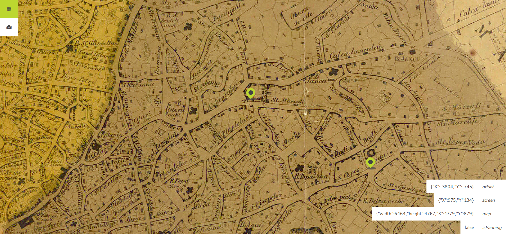

# Bucharest 1871

> A map of Bucharest in 1871



---

<!-- MarkdownTOC levels="1,2,3" autolink="true" indent="    " -->

- [About](#about)
- [Install](#install)
- [Use](#use)
- [Develop](#develop)
- [Tech dept](#tech-dept)
- [Changelog](#changelog)
    - [0.1.0 - 26 November 2018](#010---26-november-2018)

<!-- /MarkdownTOC -->

## About

- Build: [Parcel](http://parceljs.org/), [Babel 7](https://babeljs.io/)
- App framework: [React](http://reactjs.org/), [Redux](https://redux.js.org/), [React Router 4](https://reacttraining.com/react-router/web/guides/quick-start), [@asd14/redux-all-is-list](https://github.com/asd14/redux-all-is-list)
- CSS: [PostCSS](https://postcss.org/) with css modules, [Sanitize.css](https://github.com/csstools/sanitize.css) & [FontAwesome 5](https://fontawesome.com/changelog/latest)
- Lint/Types: [ESLint](https://eslint.org/) with [@asd14/eslint-config](https://github.com/asd14/eslint-config), [FlowType](https://flow.org/)
- Tests: [Tape](https://github.com/substack/tape/) and [react-test-renderer](https://reactjs.org/docs/test-renderer.html)

## Install

```bash
git clone git@github.com:andreidcm/bucharest-1871.git && \
  cd bucharest-1871 && \
  npm run setup
```

## Use

1. _Install packages and flow-typed definitions_  
`npm run setup`

1. _Setup environment variables_  
Copy and rename `.env-template` -> `.env`

1. _Start API mock server_: server on `localhost:3000` with CRUD endpoints for POI model (uses `mock-db.json` as persistent storage)  
`npm run start:mock`

1. _Start Parcel development server_:  server on `localhost:1234` where application can be accessed  
`npm start`

## Develop

```bash
# run tests (any `*.test.js`) once
npm test

# watch `src` folder for changes and run test automatically
npm run tdd
```

## Tech dept

- [ ] Dont load router in UIGrid component
- [ ] POIListPage and POIItemPage should have separate state list

## Changelog

History of all changes in [CHANGELOG.md](CHANGELOG.md)

### 0.1.0 - 26 November 2018

First
